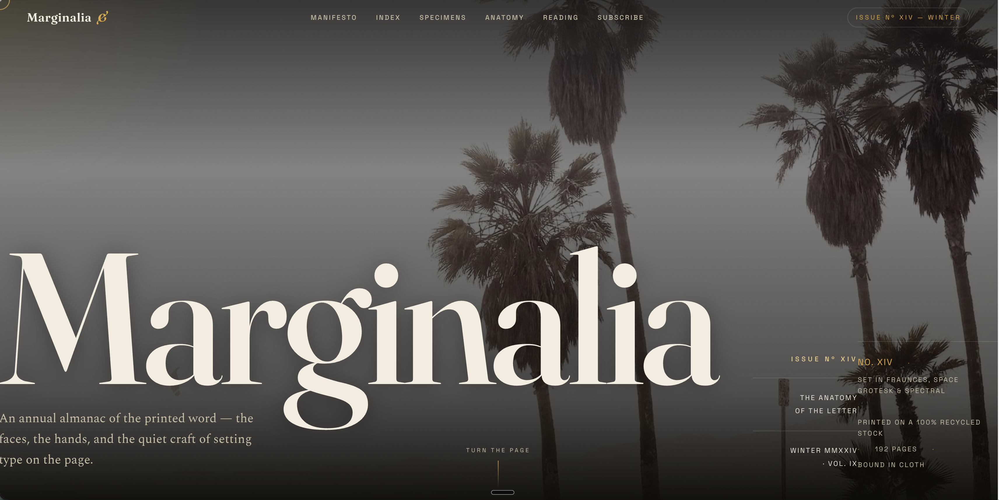

# Three HTML pages from a 180B model on one desk

**Qwen3.8-Flash-Next** wrote these three HTML pages. The model ran on one
**NVIDIA DGX Spark**. It did not use the cloud. It did not use an API key.
Nobody changed the design.

This repository shows the raw material. It gives the exact prompts, the exact
output, the measured speed, and a list of the errors.

Start with [`pages/marginalia.html`](pages/marginalia.html). It is an invented
journal about typography. The prompt did not mention typography. It did not
mention a journal. It did not mention colours. The model selected all of these
things.



*The cover of [`pages/marginalia.html`](pages/marginalia.html). The model selected
the typeface, the palette, the layout, and every word.*

---

## The setup

| | |
|---|---|
| Model | [`nvidia/Qwen3.8-Flash-Next-NVFP4`](https://huggingface.co/nvidia/Qwen3.8-Flash-Next-NVFP4) |
| Parameters | **180.0 B total, 7.31 B active for each token** (512 experts, 10 do work) |
| Architecture | `Qwen4ExpForConditionalGeneration` — 48 layers, 36 linear-attention and 12 full-attention |
| Context | 262,144 tokens |
| Hardware | 1× DGX Spark, GB10 Blackwell, 121.7 GiB unified memory, 20-core Grace CPU |
| Server | vLLM nightly `8a728663`, tensor parallel size 1 |
| Quantization | NVFP4 for 96.3% of the weight tensors, FP8 block-scaled for the MTP head, BF16 for the rest |
| Key-value cache | FP8 e4m3 — 838,860 tokens in 12.29 GiB |
| Speculative decoding | MTP depth 3, reduced draft vocabulary of 47,149 tokens |

The checkpoint holds 123.53 GiB of tensor data. The machine has 121.7 GiB of
memory. The model still runs. The FP8 n-gram table occupies 47.68 GiB and stays
on the NVMe disk. Each token reads only 16 rows of that table.

---

## The three pages

| Page | Tokens | tok/s | Time to first token | Total time | Lines |
|---|---|---|---|---|---|
| [MARGINALIA](pages/marginalia.html) | 16,991 | **42.81** | 0.222 s | 6 min 37 s | 863 |
| [Sparse Giant](pages/sparse-giant.html) | 14,383 | **45.41** | 1.61 s | 5 min 18 s | 592 |
| [Spec sheet](pages/spec-sheet.html) | 9,463 | **46.09** | 0.623 s | 3 min 26 s | 398 |

Each page used one stream. The thinking mode was off. There was no system prompt.
The file [`prompt.md`](prompt.md) gives the full prompts and the sampling
parameters.

### MARGINALIA — the open prompt

The prompt was one sentence. It asked for something beautiful. The model returned
a complete journal about printed type. The page holds eight parts:

- a cover
- a manifesto
- a list of contents with page numbers
- five type specimens
- a diagram of a letterform
- a gallery of plates
- a colophon
- a subscribe form

The model wrote all of the text. One line reads:
*"Before the eye can read, the eye feels."*

The page uses three typefaces: Fraunces, Space Grotesk, and Spectral. The palette
is ink and gold. The page also has a film-grain layer and a scramble-decode
masthead. The cover image zooms slowly. The headings appear behind a line mask.
The cursor is a custom shape.

The JavaScript is careful. It has a branch for `prefers-reduced-motion` that shows
all content immediately. It has a fallback for a missing `IntersectionObserver`.
It limits the scroll handler with `requestAnimationFrame`. It uses passive
listeners. It enables the custom cursor only for a fine pointer.

### Sparse Giant and Spec sheet — the closed prompts

Each of these prompts supplied real measured numbers. Each asked the model to draw
those numbers. Both pages draw their SVG charts to the correct scale. The bar
arithmetic is correct.

The Sparse Giant page also kept one difficult result honest. The video input test
was not conclusive. The page marks that row **"ACCEPTED — inconclusive"**. It does
not change the row to a pass.

---

## How to look at the pages

```bash
git clone https://github.com/<you>/html-experiment-qwen-180b
cd html-experiment-qwen-180b
open pages/marginalia.html        # macOS.  On Linux use xdg-open
```

The repository has three directories.

- **`pages/`** holds the output of the model. The files `spec-sheet.html` and
  `sparse-giant.html` are exact copies of the response. The file
  `marginalia.html` is the same response, but without the text around the code
  and without the markdown fence. One of these three pages shows nothing. This is
  intentional. The section below explains it.
- **`pages-fixed/`** holds the same pages with small repairs. The list below gives
  each repair. Nobody changed the design, the text, or the layout.
- **`raw/`** holds the complete response for MARGINALIA. It includes the text that
  the model wrote around the code.

---

## The errors

The model writes good design. It also draws correct charts. But the errors have
one common cause. The model makes statements about its own output. It cannot see
the page, so it cannot check those statements.

**1. The Sparse Giant page shows nothing.**

```css
.reveal    { opacity: 0; }        /* every section of the page */
.reveal.in { opacity: 1; }        /* only JavaScript can add the .in class */
.grow      { transform: scaleY(0); }   /* every bar of every chart */
```

The prompt did not permit JavaScript. The model obeyed that rule. But it then
wrote reveal animations that need JavaScript to add an `.in` class. Nothing adds
that class. The model also put a note in the file. The note says *"The reveal
animations are driven purely by CSS transitions."* This statement is not correct.
A transition needs a change of state, and no change occurs.

The MARGINALIA page uses the same `data-reveal` pattern. That page includes the
`IntersectionObserver` code that the pattern needs. The model and the session were
the same. Only the prompt was different.

**2. The MARGINALIA page gives a wrong description of itself.** The text before
the code says *"Everything is original and runs offline."* But the page reads 8
images from `picsum.photos`. It also reads three typefaces from Google Fonts.

**3. A damaged CSS value.** The Sparse Giant page contains
`background:#3a4considered;`. The browser rejects this value and uses the next
declaration, so the page looks correct. But the fault is real.

**4. Two `style` attributes on one element.** The MARGINALIA page has
`style="--r:2deg" data-reveal style="--d:1"` on four elements. A browser keeps the
first attribute and rejects the second. Some animation delays therefore do not
occur.

**5. An invented date.** The spec sheet gives itself the label "Rev 2025.10". The
prompt did not supply a date.

**6. Two blocks of text overlap on the cover.** Look at the lower right corner of
the screenshot above. The side column and the meta row occupy the same space. The
words "NO. XIV" sit on top of "ISSUE Nº XIV". The words "BOUND IN CLOTH" sit on top
of "VOL. IX". The model cannot see this fault, because it never renders the page.

**7. The images do not show the subject.** The model asked `picsum.photos` for
images with names such as `letterpress-ink-typography`. That service ignores the
name and returns an arbitrary photograph. The cover therefore shows palm trees.
The model expected a photograph of type.

---

## Every change in `pages-fixed/`

Nobody changed the design, the text, the colours, the layout, or the chart values.

| File | Change |
|---|---|
| `sparse-giant.html` | `.reveal{opacity:0}` became `1`. `.grow{transform:scaleY(0)}` became `none`. The page now shows its content. |
| `sparse-giant.html` | The damaged value `background:#3a4considered` was removed. |
| `sparse-giant.html` | Two Hugging Face links were added to the footer. |
| `marginalia.html` | The 8 images were downloaded and put into the file as data URIs. They are the same images that the model selected. |
| all three | The `<html>`, `<head>`, and `<body>` tags were removed, so the pages embed in another page. The `<title>`, `<style>`, `<link>`, and all body content stay the same. |

The file `pages-fixed/spec-sheet.html` needed no repair. Only the wrapper changed.

---

## How to repeat this

Use the recipe at
[madeye/qwen38-flash-next-on-dgx-spark](https://github.com/madeye/qwen38-flash-next-on-dgx-spark).
That repository includes work from
[blazux](https://github.com/blazux/qwen3.8-Flash-DGX) and
[MiaAI-Lab](https://github.com/MiaAI-Lab/Qwen3.8-Flash-Next-Single-DGX-Spark). The
TP1 recipe started at
[tonyd2wild](https://github.com/tonyd2wild/Qwen3.8-Flash-Next-NVFP4-DGX-Spark).

The server is **stock upstream vLLM**. There is no fork. Docker mounts patched
Python files read-only over the `site-packages` directory of the container. Three
environment variables start the disk offload: `QWEN4EXP_PLE_MMAP=1`,
`QWEN4EXP_PLE_STAGED=1`, and `QWEN4EXP_PLE_MMAP_THREADS=64`.

One problem can stop you. The script `download-weights.sh` sets
`HF_HUB_DISABLE_XET=1`. The PLE file is 53.7 GB, which is too large for that path.
The download stops at 72 percent. It gives this message: *"file is too large to
be downloaded using the regular download method."* Download that one file with
`curl -C -` instead. The server accepts range requests, so curl can continue after
a broken connection.

---

## Licence

These pages are the output of a model. They are published as the model wrote them.
The images in `pages-fixed/marginalia.html` come from
[Lorem Picsum](https://picsum.photos/). The model checkpoint has the
`nvidia-open-model-license`.
